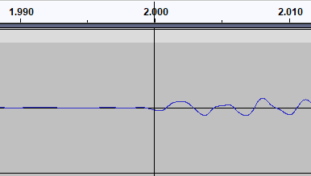
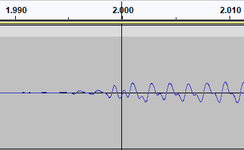
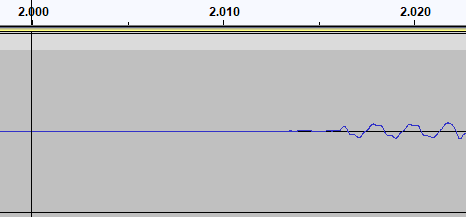
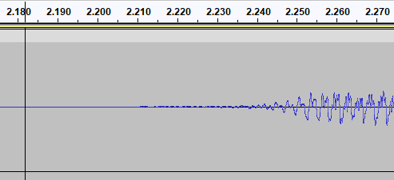

# BeatSaber maps for Milky Queen songs

This is a collection of the Milky Queen songs I have mapped and can be played on BeatSaber. It is **required** that you own the song files to be able to play, I'm not uploading the songs here and they are needed to play.

## Index

[Milky Queen](#milky-queen)

[Map showcase](#map-showcase)

[How to play the maps](#how-to-play-the-maps)

  - [Converting the song for BeatSaber](#converting-the-song-for-beatsaber)
  - [Song information](#song-information)

[Artwork](#artwork)

## Milky Queen

She is a VSinger that composes most of her music and also streams as a VTuber

[Twitch](https://www.twitch.tv/milkyqueen_idol) - [YouTube](https://www.youtube.com/@MilkyQueenVsinger) - [Twitter](https://twitter.com/milkyqueen_idol/)

[Milky Way (EP)](https://linkco.re/dy4ZpFgH)

## Map showcase

#### Palace of Glass
- **Normal** - 366 notes - 1.79 nps - [YouTube](https://youtu.be/t8FX5rr9rMs)
- **Hard** - 525 notes - 2.56 nps - [YouTube](https://youtu.be/kooc_ygiHVw)
- **Expert** - 791 notes - 3.86 nps - [YouTube](https://youtu.be/kincBdcyYj4)
- **Expert [Single Saber]** - 453 notes - 2.21 nps -  [YouTube](https://youtu.be/nM1EYNRUTsg)

#### Meteor
- **Hard** - 405 notes - 2.60 nps - [YouTube](https://youtu.be/TEuVHXZfqU4)
- **Expert [Single Saber]** - 359 notes - 2.31 nps - [YouTube](https://youtu.be/SgDnngMdg24)
- **Expert+** - 715 notes - 4.59 nps - [YouTube](https://youtu.be/JDhlVuBoZaU)

#### Milky Way
- **Hard** - 515 notes - 2.54 nps - [YouTube](https://youtu.be/_picMb1D7lA)
- **Expert** - 641 notes - 3.16 nps - [YouTube](https://youtu.be/Sf4KRKRo6VU)
- **Expert [Single Saber]** - 515 notes - 2.54 nps - [YouTube](https://youtu.be/Wcqrvwkh0FI)

#### Regina
- **Hard** - 650 notes - 2.82 nps - [YouTube](https://youtu.be/XQomgV2yslA)
- **Expert** - 864 notes - 3.75 nps - [YouTube](https://youtu.be/seWi_9Y_6og)
- **Light Expert+ [Single Saber]** - 587 notes - 2.55 nps - [YouTube](https://youtu.be/pqNHX0CwoBU)

## How to play the maps

First of all, **download the [latest release](https://github.com/sukuna-shinmyomaru/milky-queen-beatsaber/releases) of maps**

To play the map you need to place the song as a file called `song.ogg` alongside the other files, and the directory should look like this:

```
\CustomLevels
  \Palace of Glass - Milky Queen - Milky Way [EP]
     BPMInfo.dat
     cover.png
     ExpertOneSaber.dat
     ExpertStandard.dat
     HardStandard.dat
     Info.dat
     NormalStandard.dat
     song.ogg
```

The song must be encoded with _OGG Vorbis_. You'll have to add silence at the start of the song to match a beat where the map expects it.

### Converting the song for BeatSaber

You can generate the needed file `song.ogg` with [Audacity](https://www.audacityteam.org/) or any other audio editor. Audacity is open source and free, so I'm going to explain how to do it with this tool.

1. Get the song file(s): **[You can purchase/stream the EP songs here](https://linkco.re/dy4ZpFgH)**
2. To generate silence:
- With the selector at the start, go to Generate > Silence
- Enter the [value needed for the song](#song-information)
- Check that the first beat hits in the correct timestamp
- If not, undo the generated silence and change the interval duration until it fits. You can also insert a lot of silence and _slide_ the song segment on top of the silence segment until the first beat matches
3. To export as OGG Vorbis:
- Go to `File > Export Audio`
- Select `Format: Ogg Vorbis Files`
- Audio options recommended:
  - Channels: `Stereo`
  - Sample Rate: `44100` or `48000` Hz (should match your source file by default)
  - Quality: `8`
- Setting the File Name to `song.ogg` press _Export_ and place it along the other files

### Song information

Each mapped song has a beat where the map expects the first beat of the song, that's the result that matters. I'm also going to provide the silence interval I had to add use at the start, but **this might be different on other releases**. Only the result matters in the end, the file should be silent until getting to the first beat and match the waveform screenshots below:

#### Palace of Glass
- First beat: `2.000` seconds (4th beat ingame, at 120 BPM)
- Silence to add: `1.525` seconds
- How the `song.ogg` file should look like, relative to the first beat:



#### Meteor
- First beat: `2.000` seconds (5th beat ingame, at 150 BPM)
- Silence to add: `1.525` seconds
- How the `song.ogg` file should look like, relative to the first beat:



#### Milky Way
- First beat: `2.000` seconds (5th beat ingame, at 150 BPM)
- Silence to add : `1.510` seconds
- How the `song.ogg` file should look like, relative to the first beat:



#### Regina
- First beat: `2.182` seconds (4th beat ingame, at 110 BPM)
- Silence to add : `1.750` seconds
- How the `song.ogg` file should look like, relative to the first beat:



## Artwork

I made the artwork used for the songs ingame for the **Milky Way EP**. [My twitter post as a source](https://twitter.com/SukunaShinmyou1/status/1728223743930245590)


